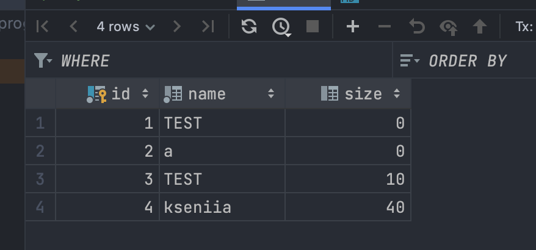

1. config.env - всякие конфиги
2. docker_compose.yml - конфиг докера, привязка ко всяким конфигам и тд
3. no-docker-file - докер файл который попросили назвать не докер файл

Как пользоваться

Если:
- У вас еще ничего нет, вы бедный и несчастный, то вызвать tool/build.sh. Это создаст контейнер и volume (там лежит бд).
- Если у вас есть контейнер, но он не запущен можно вызвать tool/start.sh. Это запустит контейнер.
- Если у вас есть контейнер и он запущен, то можно сразу вызвать tool/insert.sh

#### Как работает вставка значений.
К любому из перечисленных скриптов при вызове в командной строке передаются 2 параметра (START_NAME) и (STAR_SIZE). 

пример
```bash
bash build.sh hello 10
```

Если не передавать аргументы, ниче не случится плохого.
Также можно их менять в файле insert.sh.

Также можно вызывать например и build.sh даже
когда есть контейнер, аналогично start.sh когда контейнер запущен. В общем можно че хотите делать, взорваться не должно.

Чтобы открыть бд можно в любом доступном месте
где можно открыть бд ввести данные из config.env.

вот в PyCharm такая шняга получается
